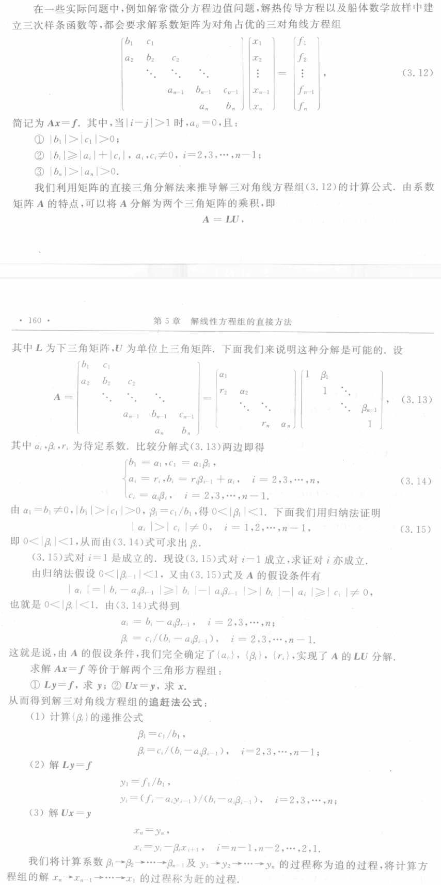

# Theorem
	- 设有[[三对角线方程组]] $\boldsymbol {Ax}=\boldsymbol f$ ,其中 $\boldsymbol A$为[[对角占优]]的[[三对角阵]], 则 $\boldsymbol A$ 为非奇异矩阵且追赶法计算公式中的$\{\alpha_i\},\{\beta_i\}$满足：
		- 0$<|\beta_i|<1,i=1,2,\cdots,n-1$;
		  logseq.order-list-type:: number
		- $0<|c_i|\leqslant|b_i|-|a_i|<|a_i|<|b_i|+|a_i|,i=2,3,\cdots,n-1$;
		  logseq.order-list-type:: number
		- $0<|b_n|-|a_n|<|a_n|<|b_n|+|a_n|$.
		  logseq.order-list-type:: number
	- ## Proof
		- 
		  #+BEGIN_PINNED
		  由 $y_{n-1}$ 推解出 $y$ 称为 *追*；
		  由 $x_{n+1} $ 推解出 $x_n$ 称为 *赶* 。
		  #+END_PINNED
	- ## 计算量
		- 追赶法公式实际上就是把高斯消去法用到求解三对角线方程组上去的结果，这时由于$\boldsymbol A$ 特别简单，因此使得求解的计算公式非常简单，而且[[计算量]]仅为 $5n-4$ 次乘除法，而另外增加解一个方程组 $Ax=f_{2}$ 仅增加 3$n-2$ 次乘除运算。易见追赶法的计算量是比较小的.
	- ## 数值稳定性
	  由定理中关于结论的 $(1)$，$(2)$ 说明追赶法计算公式中不会出现中间结果数量级的巨大增长和舍入误差的严重累积.
	- ## 存储
	  在计算机实现时我们只需用三个一维数组分别存储$A$的三条线元素$\left\{a_i\right\},\left\{b_i\right\},\left\{c_i\right\}$, 此外还需要用两组工作单元保存{$\left\{\beta_i\right\},\left\{y_i\right\}$或$\left\{x_i\right\}.$