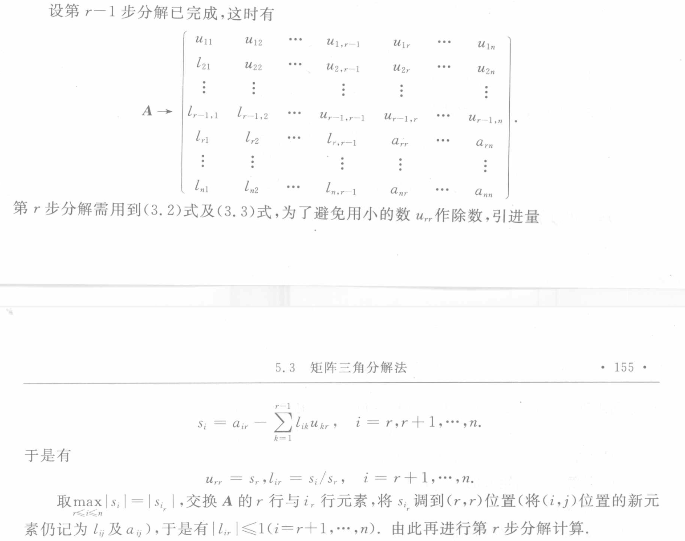
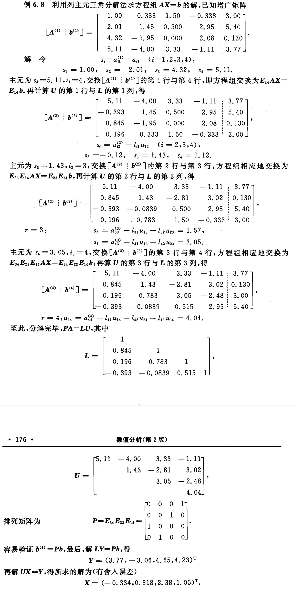

# Theorem
	- 若 $\boldsymbol A$ [[非奇异]]，则只要适当地对 $\boldsymbol A$ 作[[行交换]]，就有[[三角分解式]] $\boldsymbol{PA}=\boldsymbol{LU}$, 这里 P 为某个交换阵. 
	  logseq.order-list-type:: number
- 在 *LU 分解* 过程中得出的 $u_{rr}$ 就是 *Gauss 消去法* 消元过程 第 $r$ 步 的 *主元* ，所以$|u_rr|$愈大，算法的 *数值稳定性* 愈好. 与[[列主元消去法]]类似，可通过适当地交换方程组中各方程的位置，使每个$|u_{rr}|$尽量大.
- 
- #+BEGIN_PINNED
   
  #+END_PINNED