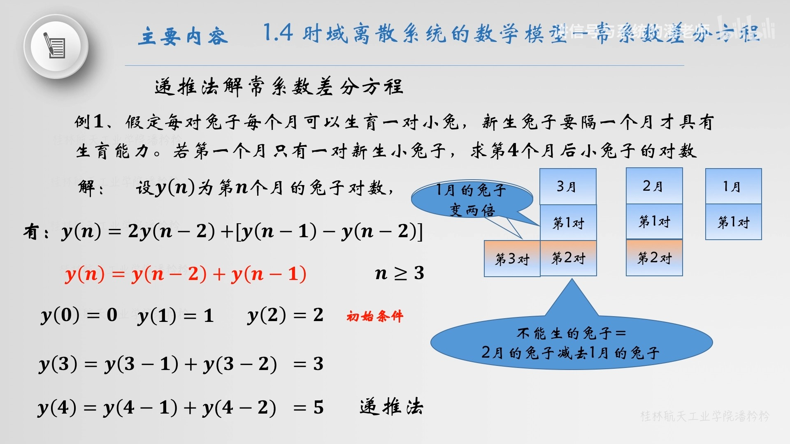

- 解常系数差分方程的递推法涉及建立一个方程，该方程反映序列的当前值与其先前值之间的关系。让我们通过具体步骤来解释这个过程：
- ### 1. 定义差分方程
  假设我们有一个二阶常系数线性差分方程如下：
  \[
  a_2 y[n+2] + a_1 y[n+1] + a_0 y[n] = x[n]
  \]
  其中 \( y[n] \) 是输出序列，\( x[n] \) 是输入序列，而 \( a_2, a_1, \) 和 \( a_0 \) 是常系数。
- ### 2. 设定初始条件
  通常，差分方程需要初始条件来解决。这些条件通常是序列的前几个值，例如 \( y[0] \) 和 \( y[1] \)。
- ### 3. 表达递推关系
  目标是表达 \( y[n+2] \) 作为先前值的函数：
  \[
  y[n+2] = \frac{1}{a_2}(x[n] - a_1 y[n+1] - a_0 y[n])
  \]
  这个公式允许我们递推地计算序列的任何值，只要我们知道初始条件和输入序列。
- ### 4. 迭代计算
  collapsed:: true
  从已知的初始条件开始，使用上面的递推关系逐步计算 \( y[n] \) 的更高值。这通常涉及到一个迭代过程，从 \( n = 0 \) 开始，逐步增加 \( n \) 的值来计算序列的后续值。
	- ### 示例
	  让我们考虑一个具体的例子：
	  \[
	  y[n+2] - 3y[n+1] + 2y[n] = x[n]
	  \]
	  假设初始条件为 \( y[0] = 1 \) 和 \( y[1] = 2 \)，且 \( x[n] \) 是某已知的输入序列。
	  递推关系将是：
	  \[
	  y[n+2] = 3y[n+1] - 2y[n] + x[n]
	  \]
	  现在，我们可以逐步计算 \( y[2], y[3], y[4], \) 等等，使用给定的 \( x[n] \) 和初始条件。
	- 对于 \( n = 0 \)：
	  \[
	  y[2] = 3y[1] - 2y[0] + x[0] = 3 \times 2 - 2 \times 1 + x[0]
	  \]
	- 对于 \( n = 1 \)：
	  \[
	  y[3] = 3y[2] - 2y[1] + x[1]
	  \]
	  并以此类推。
	  通过这种方式，可以继续计算序列的任意项 \( y[n] \)。
- ### 总结
  递推法提供了一种系统性的方法来逐步解决常系数差分方程，依赖于初始条件和已知的输入序列。这种方法适用于线性和非线性差分方程，并且是理解和实现离散时间系统动态的基础。
- 