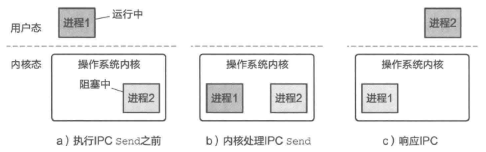

- 实现 进程间通信 除了考虑 数据传递 外，往往还会附带^^通知机制^^：在新的数据（或消
  息)到来时通知通信的接收方。
- ### [[控制流转移]]
	- 进程依赖于轮询内存数据来检查是否有消息到来 可能会浪费大量系统CPU计算资源。
	- 为了避免CPU资源的浪费，操作系统支持的 IPC 方案中，内核通常会基于^^控制流转移^^来实现 通知机制 ，如内核可以将控制流从 *发送者进程* 切换到 *接收者进程* 来实现通知接收者的效果（返回的过程类似）。
	- 我们了解到 用户态进程 其实是运行在操作系统抽象出来的时间片上的，并且进程可以有多种运行状态，如运行中、阻塞中（不再被调度）。
	  PC 中的控制流转移，通常是利用 内核对于进程的运行状态和运行时间的控制 来实现的。常见的过程如图所示。
	  
	- 以基于[[消息接口]]的 IPC 方案为例，首先，接收者进程完成初始化后将自己[[阻塞]]起来等待消息的到来（如执行阻塞的[[Recv]]),之后，发送者进程发起通信(RPC)。在处理该操作时，内核首先将发送者发送的消息传递给接收者，然后让发送者进程进入阻塞状态（等待接收者进程的回复消息），并将接收者进程从阻塞状态唤醒到可运行状态。对接收者进程而言，会看到 阻塞的Recv 返回了一个消息，表明接收到了来自发送者的消息。
	  这个特定的通信过程展示了控制流是如何在进程间转移的。
	- 可以看到，结合内核中的调度以及对进程（或线程）的[[调度状态]]的修改，控制流转移可以避免轮询操作，高效地将消息的到来和发出“告知”进程。
-
	-