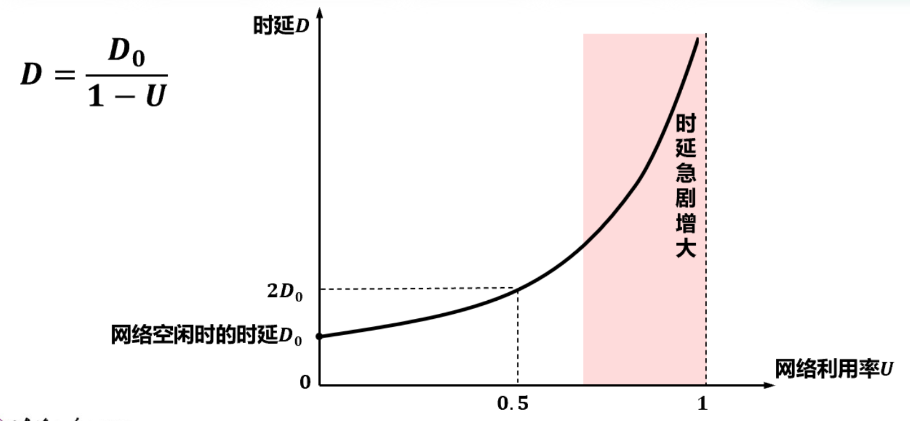

alias:: 利用率

- 链路利用率是指某条链路有百分之几的**时间**是被利用的（即有数据通过）。
  完全空闲的链路的利用率为 0 。
- 根据[[排队论]]可知，当某链路的[[利用率]]增大时，该链路引起的[[时延]]就会迅速增加。
  当网络的通信量较少时，产生的时延并不大，但在网络通信量不断增大时，分组在交换节点（路由器或交换机）中的排队时延会随之增大，因此网络引起的时延就会增大。
- $D_0$ 表示网络空闲时的时延，$D$ 表示网络当前的时延，那么在理想的假定条件下，可用下式来表示 $D$ 、$D_0$ 和网络利用率 $U$ 之间的关系：
  $$D=\frac{D_0}{1-U}$$
  
  > 一些大型[[ISP]]往往会控制信道利用率不超过50%。如果超过了就要进行扩容，增大线路的带宽。