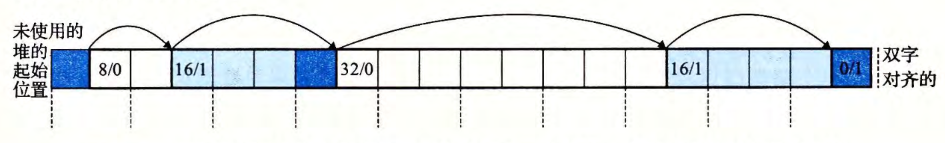

- 任何实际的分配器都需要一些数据结构，允许它来区别 块边界 ，以及区别 已分配块 和 空闲块 。大多数分配器将这些信息嵌入块本身。一个简单的方法如图所示。
	- 
- 在这种情况中，一个[[块]]是由一个字的 *头部* 、[[有效载荷]]，以及可能的一些额外的 *填充* 组成的。*头部* 编码了这个 *块的大小*（包括头部和所有的填充），以及这个块是 已分配的 还是 空闲的 。如果我们强加一个双字的[[对齐约束条件]]，那么块大小就总是 $8$ 的倍数，且块大小的最低 $3$ 位总是 0 。因此，我们只需要内存大小的 $29$ 个高位，释放剩余的3位来编码其他信息。在这种情况中，我们用其中的最低位（[[已分配位]]）来指明这个块是[[已分配的]]还是[[空闲的]]。
	- #+BEGIN_PINNED
	  例如，假设我们有一个已分配的块，大小为24(0x18)字节。那么它的头部将是
	  ``` 
	  0x00000018 | 0x1 = 0x00000019
	  ```
	   类似地，一个块大小为40(0x28)字节的空闲块有如下的头部：
	  ``` 
	  0x00000028 | 0x0 = 0x00000028
	  ``` 
	  #+END_PINNED
- *头部* 后面就是应用调用[[malloc]]时请求的 *有效载荷* 。有效载荷后面是一片不使用的 *填充块* ，其大小可以是任意的。需要填充有很多原因。
  比如，填充可能是[[分配器策略]]的一部分，用来对付[[外部碎片]]。或者也需要用它来满足[[对齐]]要求。
- 假设 *块* 的格式如上，我们可以将[[堆]]组织为一个连续的[[已分配块]]和[[空闲块]]的 *序列* ，如下图所示。其中阴影部分是 已分配块 。没有阴影的部分是 空闲块 。头部 标记为（大小（字节）／已分配位）
  
  我们称这种结构为[[隐式空闲链表]]，是因为[[空闲块]]是通过 *头部 中的大小字段* 隐含地连接着的。
  [[分配器]]可以通过遍历 *堆* 中所有的 块 ，从而间接地遍历整个 *空闲块的集合* 。
  注意，我们需要某种特殊标记的[[结束块]]，在这个示例中，就是一个设置了 已分配位 而 大小 为 0 的[[终止头部]](terminating header)。（设置已分配位简化了空闲块的合并。）