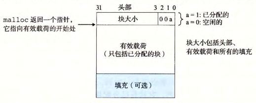

- 任何实际的分配器都需要一些数据结构，允许它来区别 块边界 ，以及区别 已分配块 和 空闲块 。大多数分配器将这些信息嵌入块本身。一个简单的方法如图所示。
	- 
- 在这种情况中，一个[[块]]是由一个字的 *头部* 、[[有效载荷]]，以及可能的一些额外的 *填充* 组成的。*头部* 编码了这个 *块的大小*（包括头部和所有的填充），以及这个块是 已分配的 还是 空闲的 。如果我们强加一个双字的[[对齐约束条件]]，那么块大小就总是 $8$ 的倍数，且块大小的最低 $3$ 位总是 0 。因此，我们只需要内存大小的 $29$ 个高位，释放剩余的3位来编码其他信息。在这种情况中，我们用其中的最低位（[[已分配位]]）来指明这个块是[[已分配的]]还是[[空闲的]]。
	- #+BEGIN_PINNED
	  例如，假设我们有一个已分配的块，大小为24(0xl8)字节。那么它的头部将是
	  ``` 
	  0x00000018 | 0x1 = Ox00000019
	  ```
	   
	  #+END_PINNED
	-