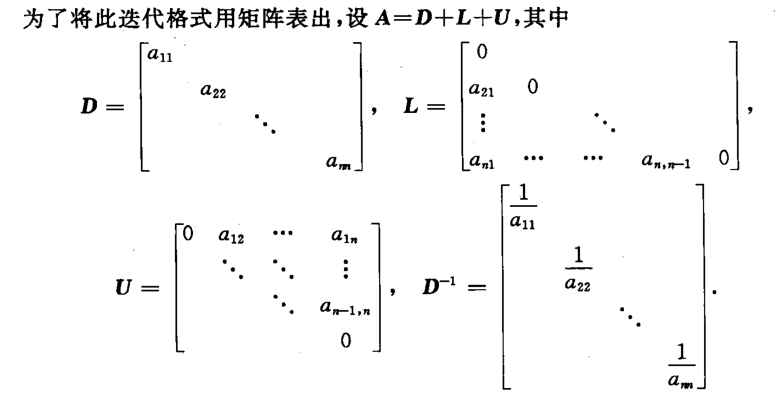

alias:: Jacobi 法, Jacobi iterative method, Jacobi 迭代法

- [[雅可比迭代法]]给定一个[[初始近似]] \( \boldsymbol {x}^{(0)} \) 来求解方程组 \( \boldsymbol A{\boldsymbol x} = \boldsymbol {b} \) 。
- ### Jacobi 迭代分量形式
	- 考察一般形式的[[方程组]]
	- $$
	  \sum_{j=1}^na_{ij}x_j=b_i,\quad i=1,2,\cdots,n.
	  $$
	- 设从上述方程组的第 $i$ 个方程中分离出变量 $x_i$，若 $a_i\neq0,(i=1,2,...,n)$ 而将它改写成
	  $$
	  x_{i}=\frac{1}{a_{ii}}(b_{i}-\sum_{j=1\atop j\neq i}^{n}a_{ij}x_{j})\:,\quad i=1,2,\cdots,n, \tag 1
	  $$
	- 据此建立的[[迭代公式]]
	  
	  $$
	  x_{i}^{(k+1)}=\frac{1}{a_{i}}(b_{i}-\underset{j\neq i}{\operatorname*{\sum}}a_{ij}x_{j}^{(k)})\:,\quad i=1,2,\cdots,n, \tag 2
	  $$
	- 称为解方程组 \( \boldsymbol A{\boldsymbol x} = \boldsymbol {b} \) 的 Jacobi 迭代分量形式.
- ### Jacobi 迭代的矩阵形式
	- 
	- 于是，式 $(1)$ 可写成如下形式 
	  $$\boldsymbol X=-\boldsymbol D^{-1}(\boldsymbol L+\boldsymbol U)\boldsymbol X+\boldsymbol F\quad(\boldsymbol F=\boldsymbol D^{-1}\boldsymbol b). \tag  3$$
	  实际上，这是将方程组 \( \boldsymbol A{\boldsymbol x} = \boldsymbol {b} \) 转化为等价方程组$\boldsymbol X=\boldsymbol{BX}+\boldsymbol F$,此处，$\boldsymbol B=-\boldsymbol D^{-1}(\boldsymbol L+\boldsymbol U).$ 根据式 $(3)$ ，可建立迭代公式
	- $$\boldsymbol X^{(k+1)}=-\boldsymbol D^{-1}(\boldsymbol L+\boldsymbol U)\boldsymbol X^{(k)}+\boldsymbol F,\quad k=0,1,2,\cdots$$
	  这个迭代公式称为 Jacobi 迭代的矩阵形式，$\boldsymbol B_{\mathrm{j}}=-\boldsymbol D^{-1}(\boldsymbol L+\boldsymbol U)$ 为其迭代矩阵.
- ## 算法步骤
	- ### 输入:
		- 方程和未知数的数量 \( n \);
		- 矩阵 \(\boldsymbol A \) 的元素 \( a[i][j] \)；
		- 向量 \(\boldsymbol b \) 的元素 \( b[i] \)；
		- 初始近似解 \(\boldsymbol {X0} \)；
		- [[容忍度]] \( TOL \)，表示迭代停止前的 *最大误差* ;
		- 最大迭代次数 \( N_{\text{max}} \)，防止无限迭代。
	- ### 输出:
		- 近似解 \( \boldsymbol X \) 或 迭代失败信息。
	- ### 步骤：
		- 初始化迭代计数器 \( k = 1 \)；
		  logseq.order-list-type:: number
		- 进行迭代，只要 \( k \leq N_{\text{max}} \) 执行步骤 a-d；
		  logseq.order-list-type:: number
			- 对每一个 \( i \)（从 $1$ 到 \( n \)）计算新的 \( X_i \)，忽略对角线元素 \( a_{ii} \)：
			  logseq.order-list-type:: number
			   $$ X_i = \frac{b_i - \sum_{\substack{j=1 \\ j \neq i}}^{n}(a_{ij} \cdot X0_j)}{a_{ii}} $$
			   这里，\( X_i \) 是第 \( k \) 次迭代后解向量 \( \boldsymbol{x} \) 的第 \( i \) 个分量。
			- 计算无穷范数 \( \| X - X \|_{\infty} \)，如果它小于 \( TOL \)，则认为已经达到所需的近似精度，输出当前的 \( X_i \) 并停止迭代；
			  logseq.order-list-type:: number
			- 更新 \(\boldsymbol {X0} \) 为新的 \(\boldsymbol X \)，为下一次迭代做准备；
			  logseq.order-list-type:: number
			- 迭代计数器 \( k \) 增加 $1$；
			  logseq.order-list-type:: number
		- 如果 \( k \) 超过 \( N_{\text{max}} \)，则表示迭代未能在给定次数内收敛到所需精度，输出失败消息。
		  logseq.order-list-type:: number
	- 这个算法的核心思想是将线性方程组的每一个方程解耦，以便独立地更新每个未知数的近似值。
	  雅可比方法要求矩阵 $\boldsymbol A$ 的**对角元素都不为零**。
	  此外，算法的收敛速度依赖于矩阵的性质和初始近似解。通常情况下，对角占优或正定矩阵更容易收敛。