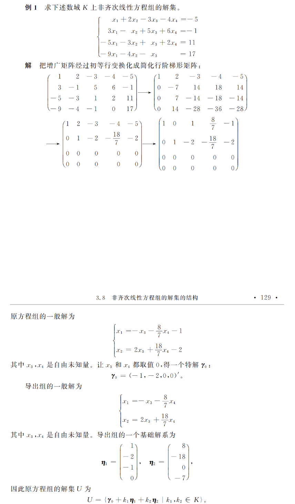

- 如果[[n元非齐次线性方程组]]有[[解]]，那么它的[[解集]] $U$ 为：
	- $$U=\{\gamma_{0}+\eta|\eta\in W\}$$
	- 其中\gamma_{0}是非齐次线性方程组的一个解（称\gamma_{0}是[[特解]]），$W$是方程组的[[导出组]]的[[解空间]]。
	- 把集合$U=\{\gamma_{0}+\eta|\eta\in W\}$记作$\gamma_0+W$，称它是一个$W$型的[[线性流形]]（几何的角度）或子空间$W$的一个[[陪集]]。
- #+BEGIN_PINNED
   
  #+END_PINNED
-