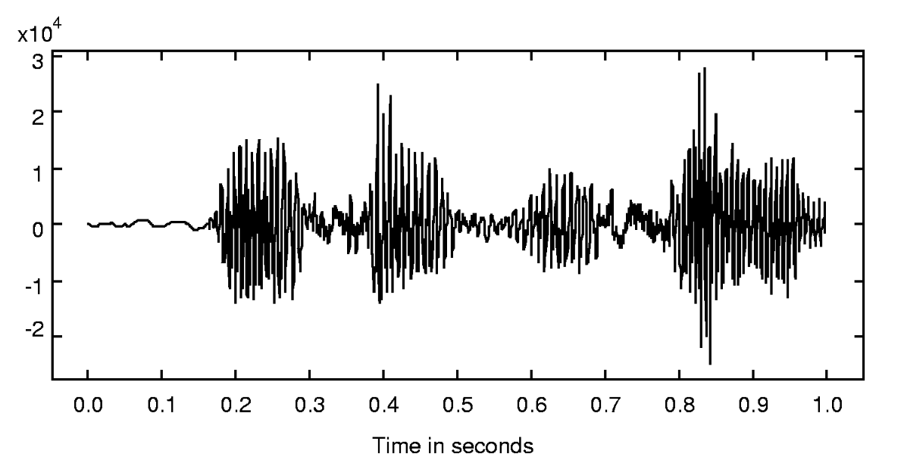
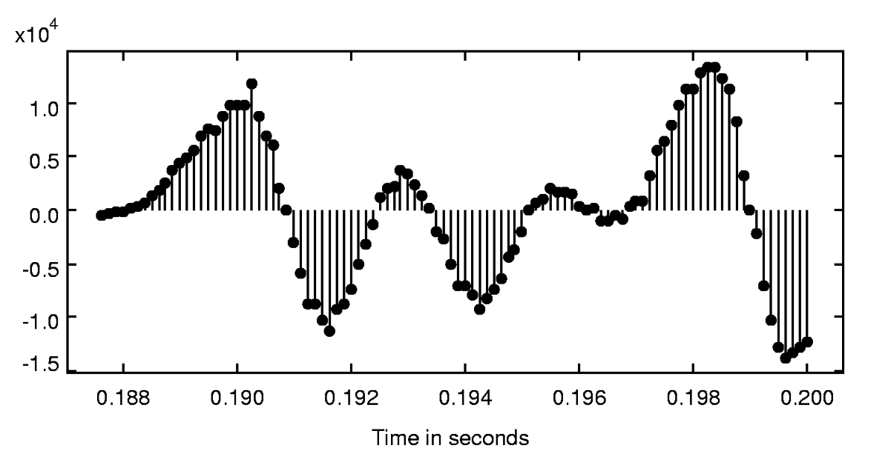
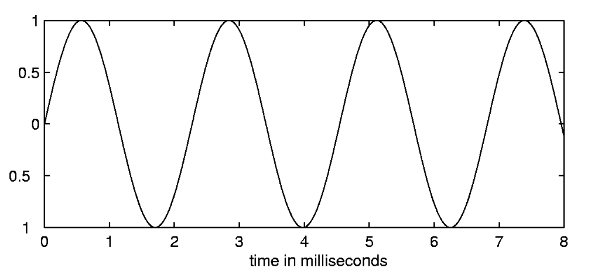

- 人耳对[[声音]]敏感, 这种声音实质上是由[[气压]]随[[时间]]迅速变化而形成的。这样,声音便可以表示成一个[[函数]],
- $$Sound: Time → Pressure$$
- 其中，[[Pressure]]是一个由可能的气压值组成的[[集合]], [[Time]]是一个表示信号持续区间的[[集合]]。
- 下图是一段语音波形，水平轴显示了时间在 $0$ 至 $1\mathrm{s}$ 内的[[连续]]变化。 
  
- 然而计算机不能直接处理这种连续区间。在计算机系统中声音不能用连续波形来表示,但可以用一系列的数值来表示。下图描绘了这种用[[离散值]]表示的一段语音波形, 这个曲线图显示了称为[[抽样值]]的100个 *数据点* 。
  id:: 650ed32a-7648-42ca-9f37-e618177a0335
- 
- 为了强调[[抽样值]], 在该曲线图中我们不用连续的曲线, 而采用点以及那些从点到横轴的连接线段来表示每个抽样值, 这种曲线称为[[杆状图]]。
  id:: 650ed4ca-7e9a-4b9c-9659-ab9221eeec61
- 由于这种信号仅在离散的时间点上有定义, 故称之为[[离散时间信号]]。
  id:: 650ed559-df53-4d57-8157-972e6b733746
  因此, 计算机中一个在 $1\mathrm{s}$ 内的[[离散时间声音信号]]是一个[[函数]],
  $$ComputerVoice: DiscreteTime\to Integers16$$
  与此相反, [[连续时间信号]]是定义在连续时间区间(为[[Reals集合]]中的一个[[连续系统]])内的[[函数]]。
- > 计算机内的音频硬件将会把 $ComputerVoice$ 函数转换成如下形式的函数 $Sound: Time→Pressure$ 。这种能将一个 *输入信号* 转换成一个不同 *输出信号* 的硬件即为一个[[系统]] .
- 由一个已精确调整的理想的 $440 \mathrm{Hz}$ 音叉在无限时间区间 $Reals =(-\infty, \infty)$ 内发出的声音,可记为如下的函数形式:
  id:: 650ed85d-d3eb-4c1f-8dad-4f0b3e5e2e78
  $$PureTone: Reals → Reals$$
  其中,与时间有关的归一化气压赋值可记为
  $$PureTone: P\sin(2\pi× 440t),\quad\forall t∈ Reals$$
  其中，$P$ 是[[正弦信号]] $PureTone$ 的[[振幅]],它是一个取实数值的 *常数* 。
- 下图显示了当 $P =1$ 时, 这种单音函数对应于 *定义域* 的一个子集范围内的一段图形。
  {:height 291, :width 608}
- 该示例中的数值 $440$ 就是图中所示 *正弦信号* 的[[频率]], 其单位是 *次数/秒* ,即[[赫兹]]。
  它意味着这种 *正弦信号* 在每秒内完成 $440$ 个周波数。换言之,这种正弦信号在$1/440 \mathrm{s}$ 或约 $2.3 \mathrm{ms}$ 内完成一个[[周波]]。
  完成一个[[周波]]所需的[[时间]], 如 $2.3\mathrm{ms}$ , 就称为[[周期]]。