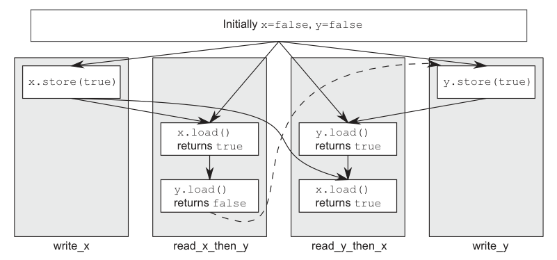

alias:: sequentially consistent ordering, 顺序一致性排序, 顺序一致, sequential consistency, sequentially consistent

- 默认排序被命名为 *顺序一致性*（Sequentially Consistent），因为它意味着程序的行为与世界的简单顺序视图一致。如果所有对[[原子类型]]实例的操作都是顺序一致的，那么多线程程序的行为就好像所有这些操作都是由单个线程按照某种特定顺序执行的。这是目前最容易理解的内存排序，这也是为什么它是默认设置：所有线程必须看到相同的[[操作顺序]]。这使得推理使用原子变量编写的代码的行为变得简单。
  id:: 65df5897-04d6-485d-b072-9e8d58fa0918
  你可以写下不同线程可能的所有操作序列，消除那些不一致的，验证你的代码在其他情况下的行为是否符合预期。这也意味着操作不能被[[重新排序]]；如果你的代码在一个线程中 一个操作 在 另一个操作 之前，那么所有其他线程必须看到这个顺序。
- 从[[同步]]的角度看，一个 顺序一致性的存储 与 读取了同一变量的顺序一致性的加载[[同步]]。这对两个（或更多）线程的操作提供了一个[[排序约束]]，但顺序一致性比这更强大。在该加载之后执行的任何 顺序一致性原子操作 也必须在 使用顺序一致性原子操作的系统 中的其他线程看到该存储**之后**出现。
- 示例演示了这个 *排序约束* 的实际操作。这个约束不适用于使用[[宽松内存排序]]的原子操作的线程；它们仍然可以看到不同的操作顺序，因此，你必须在所有线程上使用顺序一致性操作才能获得好处。
- 然而，这种易于理解可能需要付出代价。在具有许多处理器的弱**排序**机器上，它可能会带来明显的性能损失，因为必须在处理器之间保持操作的整体顺序，可能需要在处理器之间进行广泛（且昂贵）的[[同步操作]]。尽管如此，一些处理器架构（如常见的x86和x86-64架构）相对便宜地提供顺序一致性。
- ## 例子
	- 下面的示例展示了顺序一致性的实际操作。对x和y的加载和存储明确地标记为 `memory_order_seq_cst`，尽管在这种情况下可以省略这个标记，因为它是默认的。
	  ``` cpp
	  #include <atomic>
	  #include <thread>
	  #include <assert.h>
	  
	  std::atomic<bool> x,y;
	  std::atomic<int> z;
	  
	  void write_x()
	  {
	  	x.store(true,std::memory_order_seq_cst); // 1
	  }
	  
	  void write_y()
	  {
	  	y.store(true,std::memory_order_seq_cst); // 2
	  }
	  
	  void read_x_then_y()
	  {
	  	while(!x.load(std::memory_order_seq_cst));
	  	if(y.load(std::memory_order_seq_cst)) // 3
	  		++z;
	  }
	  
	  void read_y_then_x()
	  {
	  	while(!y.load(std::memory_order_seq_cst));
	  	if(x.load(std::memory_order_seq_cst)) // 4
	  		++z;
	  }
	  
	  int main()
	  {
	      x=false;
	      y=false;
	      z=0;
	      std::thread a(write_x);
	      std::thread b(write_y);
	      std::thread c(read_x_then_y);
	      std::thread d(read_y_then_x);
	      a.join();
	      b.join();
	      c.join();
	      d.join();
	      assert(z.load()!=0); // 5
	  }
	  ```
	  断言5永远不会触发，因为即使没有指定顺序，存储到x的操作1或存储到y的操作2必须首先发生。如果在`read_x_then_y`中对y的加载3返回false，那么对x的存储必须发生在对y的存储之前，在这种情况下，`read_y_then_x`中对x的加载4必须返回true，因为while循环确保此时y为true。因为`memory_order_seq_cst`的语义要求对所有标记为`memory_order_seq_cst`的操作有一个单一的总排序，所以在返回false的加载y3和存储到y1之间存在一个隐含的排序关系。为了有一个**单一的总顺序**，如果一个线程看到 `x==true` 然后随后看到 `y==false` ，这意味着在这个总顺序中，对x的存储发生在对y的存储之前。
	  因为一切都是对称的，也可能相反发生，即对x的加载返回false，迫使对y的加载3返回true。在这两种情况下，z等于1。两个加载都可以返回true，导致z变为2，但在任何情况下z都不可能是0。
	  对于`read_x_then_y`看到x为true而y为false的情况，操作和"happens-before"关系如下图所示。从`read_x_then_y`中对y的加载到`write_y`中对y的存储的虚线显示了为了维持顺序一致性所需的隐含排序关系：为了达到这里给出的结果，加载必须在全局的`memory_order_seq_cst`操作顺序中先于存储发生。
	  
- 顺序一致性是最直接和直观的排序，但它也是最昂贵的内存排序，因为它要求所有线程之间的全局同步。在多处理器系统上，这可能需要处理器之间进行广泛和耗时的通信。
- ## [[非顺序一致性排序]]
	-