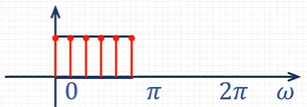
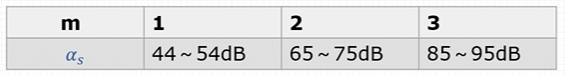
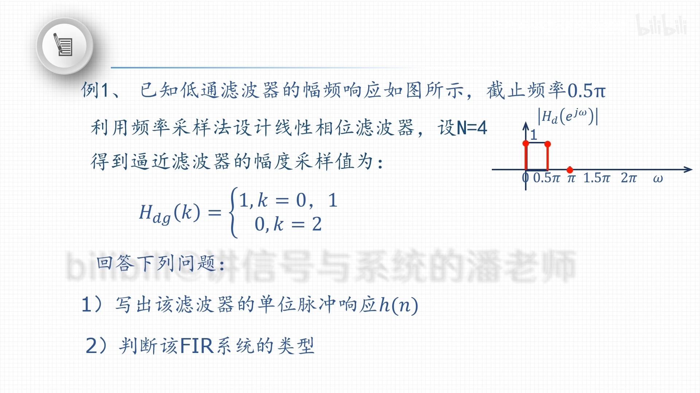
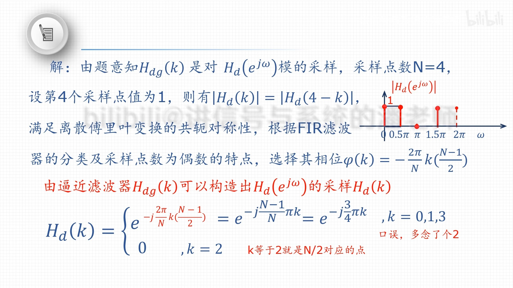
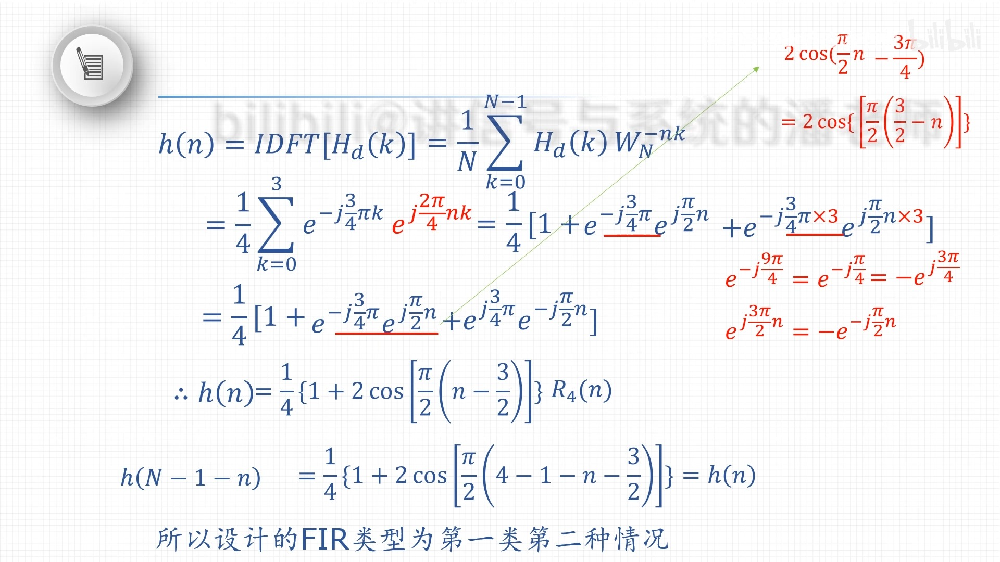
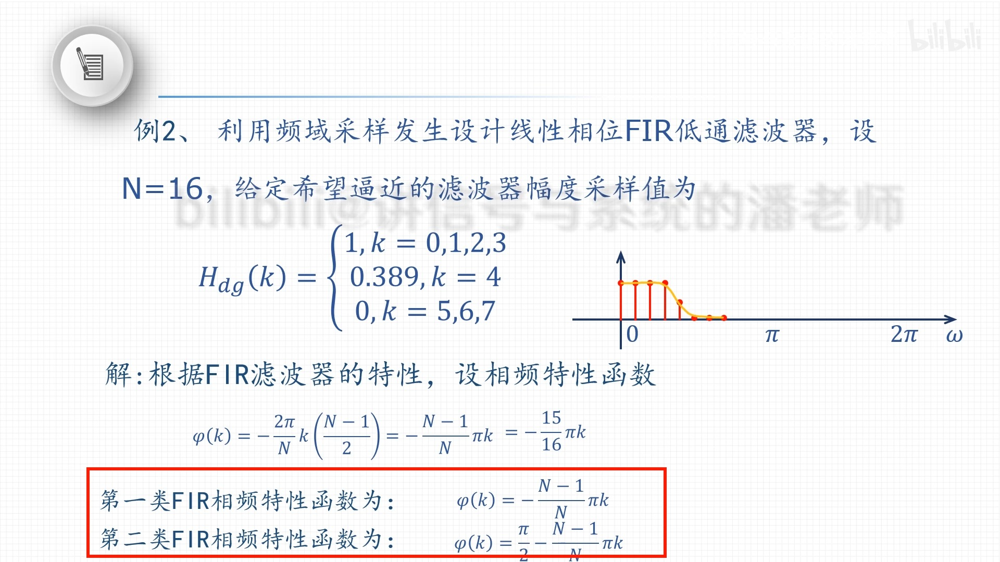
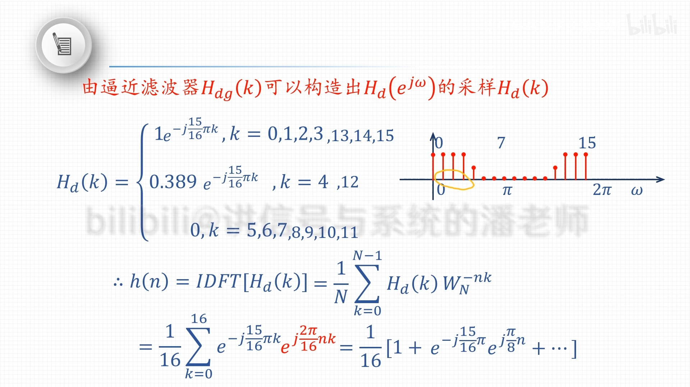
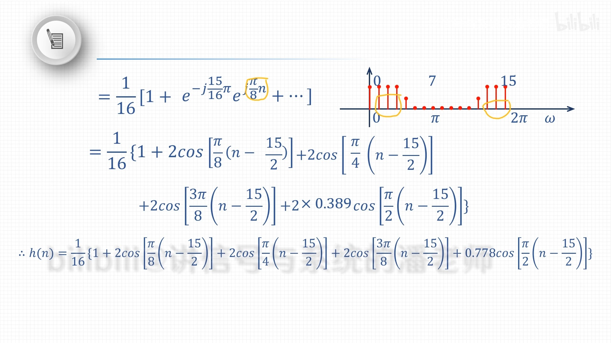

- 频率采样法在FIR滤波器设计中的思想主要是从频域出发，通过对理想频响进行等间隔采样来确定滤波器的冲激响应。
- ## 设计思想
	- **定义理想频响**:
	  logseq.order-list-type:: number
	  设计开始于定义一个[[理想频率响应]] \(\mathrm{H}_{\mathrm{d}}\left(e^{j \omega}\right)\)，这通常反映了滤波器的具体应用需求，例如低通、高通、带通或带阻特性。
	- **等间隔频率采样**:
	  logseq.order-list-type:: number
	  从理想频响中等间隔采样，采样点数 \(N\) 与滤波器的冲激响应长度相同。在每个采样点上，频率 \(\omega\) 被设定为 \(\omega = \frac{2\pi}{N}k\)，其中 \(k = 0, 1, ..., N-1\)。在这些点上的采样值定义为：
	  $$
	  \left.H_{d}\left(e^{j \omega}\right)\right|_{\omega=\frac{2\pi}{N} k} = H_{d}(k)
	  $$
	  这些值 \(H_{d}(k)\) 表示离散频率点上的期望复数响应（幅度和相位）。
	  
	- **应用逆离散傅里叶变换 (IDFT)**:
	  logseq.order-list-type:: number
	  使用[[IDFT]]对采样的频域数据 \(H_{d}(k)\) 进行处理，以得到时间域的冲激响应 \(h(n)\)：
	  $$
	  h(n) = \frac{1}{N} \sum_{k=0}^{N-1} H_{d}(k) e^{j\frac{2\pi}{N}kn}, \quad n = 0, 1, ..., N-1
	  $$
	  这里 \(h(n)\) 是实际FIR滤波器的抽头系数。
	- **Z变换得到系统函数 H(z)**:
	  logseq.order-list-type:: number
	  冲激响应 \(h(n)\) 可以通过Z变换转换成滤波器的传递函数 \(H(z)\)：
	  $$
	  H(z) = \sum_{n=0}^{N-1} h(n) z^{-n}
	  $$
	  这表示了滤波器在z域的完整描述，可用于进一步分析和实现。
- ## 设计步骤
	- **确定过渡带点数 \( m \)**:
	  logseq.order-list-type:: number
		- 依据所需的阻带衰减 \( a_s \)，查表确定合适的过渡带点数 \( m \)。例如，如果需要的阻带衰减是 \( 60 \)dB，则选择 \( m=2 \)。
		  
	- **确定滤波器长度 \( N \)**:
	  logseq.order-list-type:: number
		- 使用过渡带宽度 \( B_t \) 和过渡带点数 \( m \) 确定滤波器的最小长度 \( N \)，遵循不等式 \( N \geq \frac{2\pi}{B_t}(m+1) \)。实际中，\( N \) 可能需要取比这个不等式更大的值，以满足其他设计要求，如通带纹波或具体的硬件限制。
	- **确定逼近滤波器 \( H_{dg}(k) \)**:
	  logseq.order-list-type:: number
		- 定义一个逼近的幅度响应 \( H_{dg}(k) \)，通常是在滤波器通带和阻带的频率点上取值为 \(1\) 或 \(0\)，并且在过渡带内适当地过渡。这个逼近应考虑实际应用中的设计容差。
	- **构造复数频响 \( H_d(k) \)**:
	  logseq.order-list-type:: number
		- 结合逼近幅度响应 \( H_{dg}(k) \) 和相位函数 \( \varphi(k) \)，构造复数频响 \( H_d(k) = H_{dg}(k) e^{j\varphi(k)} \)。在实数FIR滤波器设计中，通常 \( \varphi(k) \) 被设置为线性相位函数，以保持滤波器的无失真特性。
	- **计算IDFT得到 \( h(n) \)**:
	  logseq.order-list-type:: number
		- 对复数频响 \( H_d(k) \) 进行逆离散傅里叶变换（IDFT），得到滤波器的单位冲激响应 \( h(n) \)。这个冲激响应 \( h(n) \) 将是实际FIR滤波器的系数。
- ### 注意事项
	- **窗函数的选择**：
	- 在实际应用中，可能需要对 \( h(n) \) 应用窗函数，以减少设计中的旁瓣泄漏，并改进滤波器的频率选择性。
	- **处理频率泄漏和吉布斯现象**:
	  理想频响的突然变化可能在频域采样中引起频率泄漏和[[吉布斯现象]]。适当选择窗函数和调整窗宽可以有效地减轻这些效应。
	- **阻带衰减的实现**：
	- 表中给出的阻带衰减范围（如 \( 44 \)dB 至 \( 54 \)dB）应被视为设计时的指导。实际阻带衰减取决于窗函数的特性和滤波器长度 \( N \)。
	- **频率采样点的分布**：
	- 应确保频率采样点均匀分布在 \( 0 \) 到 \( 2\pi \) 范围内，以避免非均匀采样可能引入的频率
	  泄漏问题。
	- **性能验证**：
	- - 在设计完成后，应通过模拟或实际条件下测试来验证滤波器的性能，确保它满足所有的设计规范。
	  <!--Converted by ToLogseq-->
-
	- <!--Converted by ToLogseq-->
- ## 例子
	- 
	  
	  
	- 
	  
	  