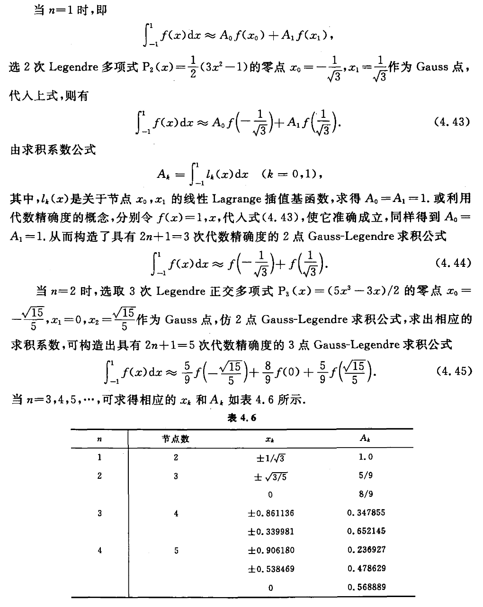

alias:: Gauss-Legendre Quadrature

- 高斯-勒让德求积公式（Gauss-Legendre Quadrature）是一种高斯型求积公式，它在数值积分中广泛使用，特别适合计算区间 \([-1, 1]\) 上的定积分。这种方法通过特定的节点（即积分点）和权重来近似积分，这些节点是勒让德多项式的零点。以下是高斯-勒让德求积公式的基本形式和特点：
  
  1. **公式**：
	- 对于区间 \([-1, 1]\) 上的积分，高斯-勒让德求积公式可以表示为：
	  $$ \int_{-1}^{1} f(x) \, dx \approx \sum_{i=1}^{n} w_i f(x_i) $$
	- 其中，\(x_i\) 是[[勒让德多项式]] \(P_n(x)\) 的零点，\(w_i\) 是对应的权重，由下式给出：
	  $$ w_i = \frac{2}{(1 - x_i^2)[P_n'(x_i)]^2} $$
	- 这里，\(P_n(x)\) 是 \(n\) 阶勒让德多项式，\(P_n'(x_i)\) 是该多项式在 \(x_i\) 处的导数。
	  
	  2. **节点和权重**：
	- 节点 \(x_i\) 是勒让德多项式的零点，这些点不是等距的，而是根据多项式的特性分布在 \([-1, 1]\) 区间上。
	- 权重 \(w_i\) 确保了对于所有不超过 \(2n-1\) 阶的多项式，高斯-勒让德求积公式都能给出精确的积分结果。
	  
	  3. **适用性**：
	- 高斯-勒让德求积非常适合于光滑函数或多项式函数的积分计算。
	- 对于非多项式函数，增加节点数 \(n\) 可以提高积分的近似精度。
	  
	  4. **变换积分区间**：
	- 如果需要计算非标准区间 \([a, b]\) 上的积分，可以通过线性变换将积分区间从 \([a, b]\) 映射到 \([-1, 1]\)。
	  
	  高斯-勒让德求积公式在数值积分中非常重要，因为它能够在相对较少的节点下提供高精度的结果。这使得它在计算资源有限的情况下特别有用。
	- 