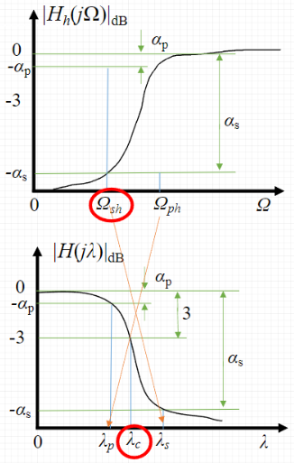

-
- ## 巴特沃斯模拟高通滤波器设计
	- ### 高通滤波器的参数指标
	  通带截止频率 $\Omega_{\mathrm{ph}}$，通带衰减 $\alpha_{p}$ 
	  阻带截止频率 ${\Omega}_{\mathrm{sh}}$，阻带衰减 $\alpha_{\mathrm{s}}$
	- ### 设计步骤
		- 将高通滤波器的指标转换成低通归一化指标
		  logseq.order-list-type:: number
		  归一化通带截止频率 $\lambda_{p}=1$ 
		  归一化阻带截止频率 $\lambda_{\mathrm{s}}=\frac{\Omega_{\mathrm{ph}}}{\Omega_{\mathrm{sh}}}$
		- 按[[巴特沃斯低通滤波器的设计]]方法计算低通滤波器的阶数 $\mathrm{N}$
		  logseq.order-list-type:: number
		- 查表得到低通滤波的归一化传输函数 $G_{a}(p)$ 
		  logseq.order-list-type:: number
		- 计算归一化 $3 \mathrm{~dB}$ 截止频率 
		  logseq.order-list-type:: number
		  $$\quad \lambda_{c}=\lambda_{\mathrm{p}}\left(10^{0.1 \alpha_{\mathrm{s}}}-1\right)^{-\frac{1}{2 N}}$$
		- 令 $p=\frac{\Omega_{p \mathrm{~h}}}{s \lambda_{c}}$ 将 $G_{a}(p)$ 转换成 $H_{H P}(s)$ 即为所求高通滤波器系统函数
		  logseq.order-list-type:: number
		- 
- ### 双线性变换法转换为数字滤波器
  求解模拟高通滤波器 $$H_{H P}(s)$$ 用[[双线性变换法]]将 $H_{H P}(s)$ 转换成 $\mathrm{H}(z)$：
  $$H(z)=\left.H_{a}(s)\right|_{s=\frac{2}{T}} \frac{1-\alpha z^{-1}}{1+\alpha z^{-1}}$$
   $\alpha$ 是模拟频率映射到数字频率时的[[频率压缩系数]]，一般取 $\alpha=-\frac{1}{2}$ 。
- ## 例子
	- ((6616943f-8991-46fe-8213-c10395ac0586))
-